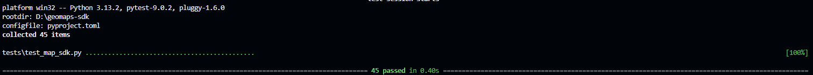

# GeoMaps SDK – Vendor‑Agnostic Location & Maps Platform

A **provider‑agnostic Python SDK** for building location‑aware applications without coupling your code to a single maps vendor. GeoMaps SDK defines a **stable, unified API** that works across providers such as **Geoapify, Google Maps, Mapbox, and OpenStreetMap/Nominatim**.

The goal is simple:

> **Write your location logic once. Swap vendors anytime.**

---

## 🌍 Why Vendor‑Agnostic?

Most mapping SDKs tightly bind your application to a single provider:

* API contracts differ
* Units are inconsistent
* Error handling is vendor‑specific
* Migration costs are high

**GeoMaps SDK solves this** by introducing a clean abstraction layer:

* A single API surface
* Normalized data models
* Predictable units
* Explicit error semantics

Your application code never talks to vendor APIs directly.

---

## ✨ Core Capabilities

* 🔌 **Pluggable Providers** – Swap vendors via dependency injection
* 🗺 **Geocoding & Reverse Geocoding**
* 🔎 **Autocomplete / Place Search**
* 🚗 **Routing & Travel Time Estimation**
* 📏 **Distance Matrix Calculations**
* 🧱 **Strong Domain Models** (GeoPoint, Address, RouteInfo, etc.)
* 🛑 **Consistent Error Handling Across Vendors**
* 🧪 **Fully Unit‑Tested (45/45 tests passing)**
* 📦 **Modern Python Packaging (`pyproject.toml`)**

---

## 📦 Installation

### Requirements

* Python **3.9+**

### Install

* using this repo's url

```bash
pip install git+https://github.com/Shetty073/geomaps-sdk.git@main
```

* editable mode for development and testing

```bash
pip install -e .
```

* actual build

```bash
python -m build
```

> Note: This package is not yet available on PyPI. Hence, for now it is recommended that you install this via the github url.

Dependencies are declared in `pyproject.toml` and installed automatically.

---

## 🚀 Quick Start

### Initialize a Client

```python
from geomaps_sdk import LocationClient, GeoapifyProvider

client = LocationClient(
    provider=GeoapifyProvider(api_key="YOUR_API_KEY")
)
```

### Geocode an Address

```python
results = client.geocode("1600 Amphitheatre Parkway, CA")
location = results[0].location

print(location.latitude, location.longitude)
```

### Reverse Geocoding

```python
from geomaps_sdk import GeoPoint

point = GeoPoint(37.4220, -122.0841)
addresses = client.reverse_geocode(point)
print(addresses[0].formatted_address)
```

### Routing

```python
route = client.route(source, target)

print(route.distance_km)        # kilometers
print(route.duration_minutes)  # minutes
```

### Context Manager (Recommended)

```python
with LocationClient(provider=GeoapifyProvider(api_key="KEY")) as client:
    client.geocode("Paris, France")
```

---

## 🧠 Domain Model (Vendor‑Neutral)

### GeoPoint

Represents a geographic coordinate.

```python
GeoPoint(latitude=12.9716, longitude=77.5946)
```

* Always **WGS‑84**
* Immutable

---

### Address

A normalized postal address independent of provider structure.

```python
Address(
    street="Amphitheatre Parkway",
    city="Mountain View",
    postcode="94043",
    country="United States",
    country_code="us"
)
```

---

### GeocodingResult

```python
result.location      # GeoPoint
result.address       # Address
result.confidence    # float (0.0 – 1.0)
```

Confidence scores are normalized across vendors.

---

### RouteInfo

```python
route.distance           # meters
route.duration           # seconds
route.distance_km        # kilometers
route.duration_minutes   # minutes
```

✔️ Raw values preserve API fidelity
✔️ Derived properties improve developer ergonomics

---

### DistanceMatrixResult

```python
result.distances[i][j]  # meters
result.durations[i][j]  # seconds
```

Guaranteed consistent units regardless of provider.

---

## 🚦 Enumerations

### TravelMode

```python
DRIVING | WALKING | CYCLING | TRUCK
```

Mapped internally to vendor‑specific mode strings.

---

### DistanceUnit

```python
METERS | KILOMETERS | MILES
```

Used only for presentation — raw data remains metric.

---

## 🔌 Providers

### Built‑in

| Provider    | Status         | Notes               |
| ----------- | -------------  | ------------------- |
| Geoapify    | ✅ Implemented | Default provider    |
| Google Maps | ⏳ Planned     | Drop‑in replacement |
| Mapbox      | ⏳ Planned     | Drop‑in replacement |
| Nominatim   | ⏳ Planned     | OpenStreetMap based |

---

### Adding a New Provider

Implement `BaseLocationProvider`:

```python
class CustomProvider(BaseLocationProvider):
    def geocode(self, query): ...
    def reverse_geocode(self, location): ...
    def autocomplete(self, query, limit): ...
    def distance_matrix(self, sources, targets, mode, units): ...
    def route(self, source, target, mode): ...
```

✔️ No changes required in application code

---

## ⚠️ Error Model (Unified)

All providers raise the same exception types:

* `ValidationError`
* `AuthenticationError`
* `RateLimitError`
* `APIError`

This makes retries, logging, and fallbacks trivial.

---

## 🧪 Testing

```bash
pip install -e .[dev]
pytest
```

### Latest Test Results



---

## 🏗 Architecture & Design

* **Strategy Pattern** – Provider swapping
* **Dependency Injection** – Provider passed into client
* **DTO‑based Domain Models** – Immutable, explicit data
* **Single Responsibility** – Client vs Provider separation

---

## 📜 License

MIT License

---

## ❤️ Contributing

Want to add a new provider or feature?

1. Implement the provider interface
2. Add unit tests
3. Ensure `pytest` passes
4. Open a pull request

---

**GeoMaps SDK** – Made with ❤️ for developers who want clean, maintainable location services code.

[](https://github.com/PyCQA/bandit)
